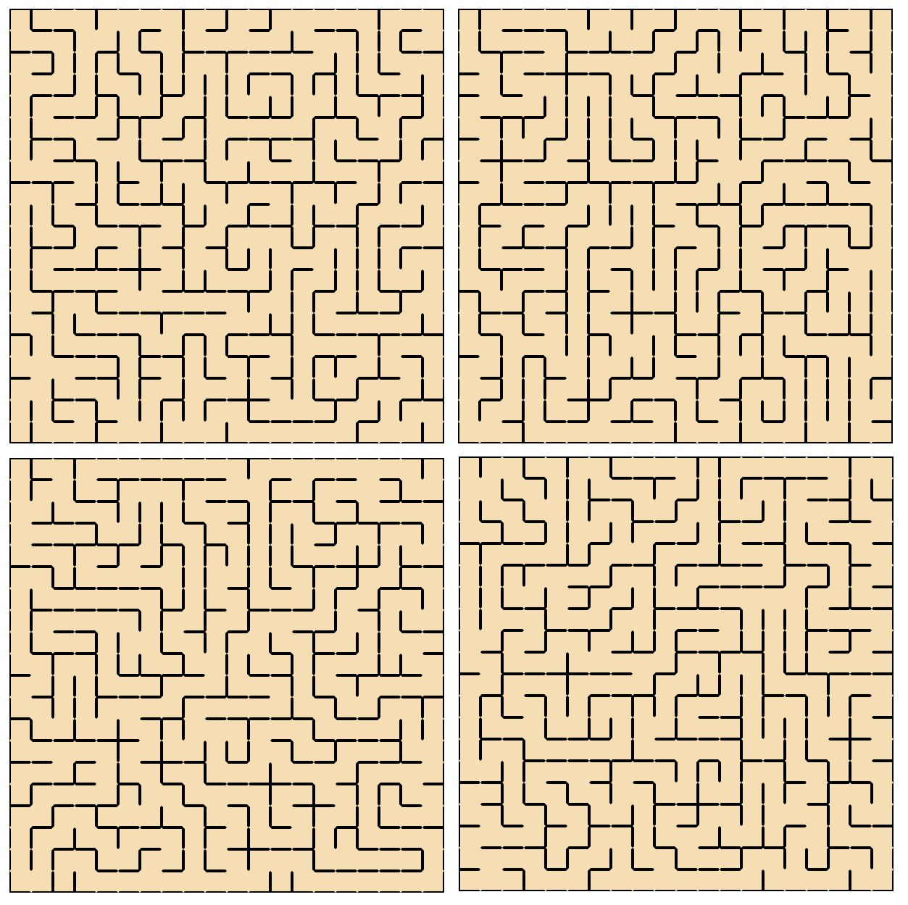
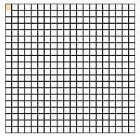
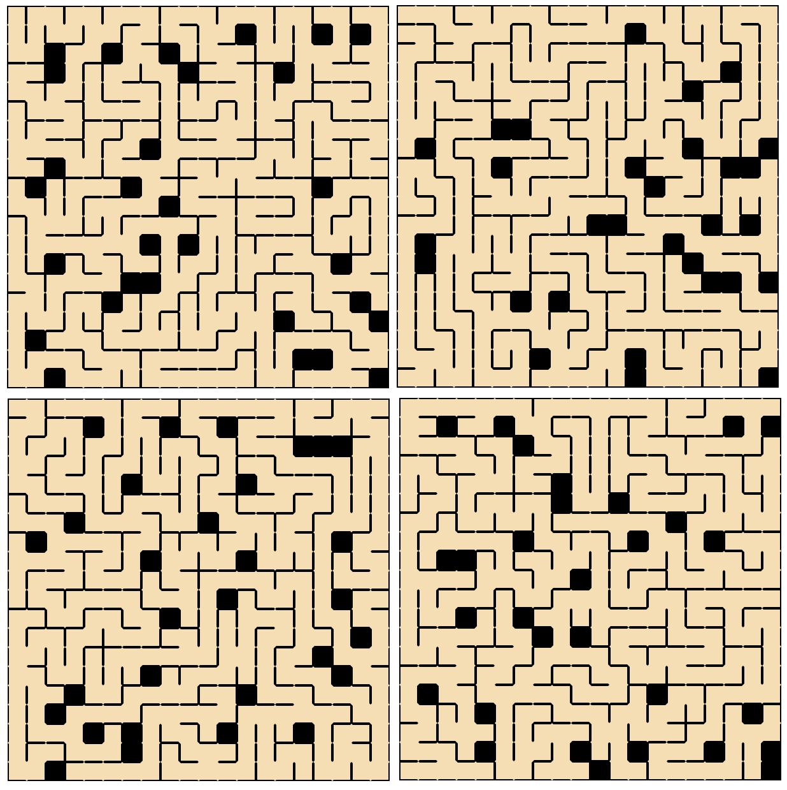

# Maze and dungeon generator
Originaly inspired by [Path of exile](https://www.pathofexile.com/ "Official game website") [delve](https://pathofexile.gamepedia.com/Delve "Path of exile game wiki - Delve")  endless dungeon with randomly generates passes and biomes.    
### Algorithm   
I've built it around __cells IDs__ containing X and Y coordinates, forming a grid of set size.
I created algorithm myself, but I found it very similar to [depth first search](https://en.wikipedia.org/wiki/Depth-first_search "Depth first search") algorithm.      
Did minimum design. Mostly was interested in algorithm itself. Current styles are based on CSS variables and grid layout. Later I want to implement biomes generation for different parts of the maze (where most styles will be applied).     
I added small validation at the end based on `Set()` collection property that elements are unique (not repeated).   
        
This is few end results for normal maze:     
     
Maze generation in action:     
     
Maze with some cells blocked (number of blocked cells can be tweaked):     
     
Maze with extra doors (more like dungeon style):     
     
     
### Settings
Maze settings (size, blocked cells, extra passages) set in constants at the start of the script.    
Note: if making changes to the size - require CSS variables changes in styles.css file too to render correctly.    

### Test it yourself
Live version can be found [here](http://artem-soroka.tk/pages/maze/ "Maze generator").   
     
Thank you.